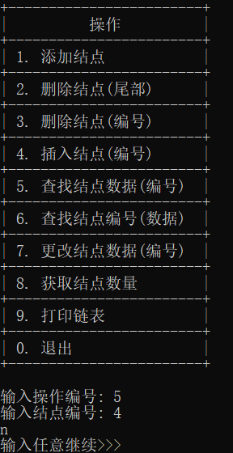

# 链表

## 概述

本设计文档详细描述了一个基于单链表结构的 `LinkList` 类的实现。`LinkList` 类提供了一组操作接口，用于实现链表的增删改查等基本功能。链表中的每个节点由 `Node` 类表示，包含一个字符串类型的数据域 `data` 和一个指向下一个节点的指针 `next`。

## 类定义

### Node 类

- 属性:
  - `data`: 字符串类型，用于存储节点数据。
  - `next`: `Node*` 类型，指向链表中下一个节点的指针。

### LinkList 类

- **私有属性**:
  - `head`: `Node*` 类型，指向链表头节点的指针。
  - `tail`: `Node*` 类型，初始化时创建一个新节点，用于指向链表尾节点。
  - `dataCount`: 整型，记录链表中节点的数量，最大值为20。
- **公有方法**:
  - `LinkList()`: 构造函数，用于初始化链表。
  - `void insert(string data)`: 尾部插入节点。
  - `void insert(string data, int location)`: 在指定位置插入节点。
  - `void deleteNode(int location)`: 删除指定位置的节点。
  - `void deleteNode()`: 删除指定数据的节点。
  - `void change(int location, string data)`: 更改指定位置节点的数据。
  - `string find(int location)`: 查找指定位置的节点数据。
  - `int find(string data)`: 查找指定数据的位置，只返回第一次查找到的位置。
  - `void printList()`: 打印整个链表。
  - `int getLength()`: 返回链表的长度。

## 功能描述

### 构造函数

- 初始化链表，设定头节点和尾节点为 `nullptr`，数据计数器 `dataCount` 为0。

### 尾插

- 向链表尾部插入一个新的节点，节点数据由参数 `data` 指定。

### 指定位置插入

- 在链表的指定位置插入一个新的节点，位置由参数 `location` 指定，节点数据由参数 `data` 指定。

### 删除节点

- `void deleteNode(int location)`: 根据位置删除节点。
- `void deleteNode()`: 根据数据删除节点。**注意**: 此方法签名似乎缺少数据参数，应考虑修正。

### 数据修改

- 修改指定位置节点的数据，位置由 `location` 指定，新数据由 `data` 指定。

### 查找

- `string find(int location)`: 查找并返回指定位置节点的数据。
- `int find(string data)`: 查找特定数据的节点位置，只返回首次找到的位置。

### 打印链表

- 遍历链表并打印每个节点的数据。

### 获取链表长度

- 返回链表中节点的数量

### 类框架

```c++
class Node {
public:
	string data;
	Node* next;
};

class LinkList {
private:
	Node* head;
	Node* tail = new Node();
	int dataCount;	//最大值为20

public:
	LinkList();									//构造函数
	void insert(string data);					//尾插
	void insert(string data, int location);		//在某序号插入
	void deleteNode(int location);				//删除某序号位结点
	void deleteNode();							//删除指定数据
	void change(int location, string data);		//更改某位置数据
    string find(int location);
	int find(string data);						//查找数据，并返回位置,只返回第一查找到的
	void printList();
	int getLength();
};
```

### 功能实现

1. 构造函数

   ```c++
   LinkList::LinkList():dataCount(0) {		//构造函数
   	head = new Node();
   	head->next = NULL;
   	tail = head;
   }
   ```
   
2. 添加数据(新数据插入尾部)

   ```c++
   void LinkList::insert(string data) {		//尾插
   	if (dataCount == 20) {
   		cout << "链表已满" << endl;
   		return;
   	}
   	Node* p = new Node();
   	p->data = data;
   	p->next = NULL;
   	tail->next = p;
   	tail = p;
   	dataCount++;
   }
   ```

3. 添加数据(新数据插入自定义位置)

   ```c++
   void LinkList::insert(string data, int location) {		//在某序号插入 // 重载
   	if (dataCount == 20) {		//最大值20
   		cout << "链表已满" << endl;
   		return;
   	}
   	else if (location > 0 && location <= dataCount + 1) {
   		Node* p = head;
   		Node* q = new Node();
   		location--;
   		while (location--) {
   			p = p->next;
   		}
   		q->data = data;
   		q->next = p->next;
   		p->next = q;
   		if (location == dataCount + 1) {
   			tail = q;
   		}
   		dataCount++;
   	}
   	else {
   		cout << "超出范围" << endl;
   	}
   }
   ```
   
4. 删除某序号位结点

   ```c++
   void LinkList::deleteNode(int location) {
   	if (location > 0 && location <= dataCount) {
   		Node* p = head;
   		location--;
   		while (location--) {
   			p = p->next;
   		}
   		if (p->next->next == NULL) {
   			tail = p;
   		}
   		Node* q = p->next;
   		p->next = q->next;
   		delete(q);
   		dataCount--;
   	}
   	else if (dataCount == 0) {
   		cout << "没有数据了!!";
   		return;
   	}
   	else {
   		cout << "删出范围了";
   		return;
   	}
   }
   ```

5. 删除最尾部数据

   ```c++
   void LinkList::deleteNode() {	
   	bool found = false;
   	Node* p = head;
   	if (p->next == NULL) {
   		cout << "未找到相应数据" << endl;
   		return;
   	}
   	while(p->next->next) {
   		p = p->next;
   	}
   	tail = p;
   	p = p->next;
   	tail->next = NULL;
   	delete(p);
   	dataCount--;
   }
   ```
   
6. 更改某位置的数据

   ```c++
   void LinkList::change(int location, string data) {	//更改某位置数据
   	if (location > 0 && location <= dataCount) {
   		Node* p = head;
   		while (location--) {
   			p = p->next;
   		}
   		p->data = data;
   	}
   	else {
   		cout << "超出范围了" << endl;
   	}
   }
   ```


7. 查找第几个结点数据为什么名字

   ```c++
   string LinkList::find(int location) {   // 查找结点，若超出范围则返回最后一个元素
   	Node* p = head;
   	while (p && p->next && location--) {
   		p = p->next;
   	}
   	return p->data;
   }
   ```

8. 查找此名字数据为第几个结点

   ```c++
   int LinkList::find(string data) {		//查找数据，并返回位置,只返回第一查找到的
   	Node* p = head;
   	int location = -1;
   	int temp = 0;		//记录当前位置
   	while (p->next != NULL) {
   		p = p->next;
   		temp++;
   		if (p->data == data) {
   			location = temp;
   			break;
   		}
   	}
   	if (location == -1) {
   		cout << "数据不存在";
   	}
   	return location;
   }
   ```

9. 获取链表长度

   ```c++
   int LinkList::getLength() {
   	return dataCount;
   }
   ```

10. 打印链表

    ```c++
    void LinkList::printList() {
    	for (int i = 0; i < 2; ++i) {
    		cout << endl;
    	}
    	Node* p = head;
    	while (p->next != NULL) {
    		p = p->next;
    		cout << p->data << " ";
    		if (p->next != NULL) {
    			cout << "-->" << " ";
    		}
    	}
    	for (int i = 0; i < 3; ++i) {
    		cout << endl;
    	}
    }
    ```

## 完整代码

> list.h
>
> ```c++
> #pragma once
> #include <string>
> using namespace std;
> 
> #ifndef _LINKLIST_H_
> #define _LINKLIST_H_
> 
> class Node {
> public:
> 	string data;
> 	Node* next;
> };
> 
> class LinkList {
> private:
> 	Node* head;
> 	Node* tail = new Node();
> 	int dataCount;				//最大值为20
> 
> public:
> 	LinkList();		//构造函数
> 	void insert(string data);		//尾插
> 	void insert(string data, int location);		//在某序号插入 // 重载
> 	void deleteNode(int location);		//删除某序号位结点
> 	void deleteNode();		//删除指定数据
> 	void change(int location, string data);	//更改某位置数据
> 	string find(int location);
> 	int find(string data);		//查找数据，并返回位置,只返回第一查找到的
> 	void printList();
> 	int getLength();
> };
> #endif
> ```

> list.cpp
>
> ```c++
> #include <iostream>
> #include "list.h"
> using namespace std;
> 
> LinkList::LinkList():dataCount(0) {		//构造函数
> 	head = new Node();
> 	head->next = NULL;
> 	tail = head;
> }
> 
> void LinkList::insert(string data) {		//尾插
> 	if (dataCount == 20) {
> 		cout << "链表已满" << endl;
> 		return;
> 	}
> 	Node* p = new Node();
> 	p->data = data;
> 	p->next = NULL;
> 	tail->next = p;
> 	tail = p;
> 	dataCount++;
> }
> 
> void LinkList::insert(string data, int location) {		//在某序号插入 // 重载
> 	if (dataCount == 20) {		//最大值20
> 		cout << "链表已满" << endl;
> 		return;
> 	}
> 	else if (location > 0 && location <= dataCount + 1) {
> 		Node* p = head;
> 		Node* q = new Node();
> 		location--;
> 		while (location--) {
> 			p = p->next;
> 		}
> 		q->data = data;
> 		q->next = p->next;
> 		p->next = q;
> 		if (location == dataCount + 1) {
> 			tail = q;
> 		}
> 		dataCount++;
> 	}
> 	else {
> 		cout << "超出范围" << endl;
> 	}
> }
> 
> void LinkList::deleteNode(int location) {
> 	if (location > 0 && location <= dataCount) {
> 		Node* p = head;
> 		location--;
> 		while (location--) {
> 			p = p->next;
> 		}
> 		if (p->next->next == NULL) {
> 			tail = p;
> 		}
> 		Node* q = p->next;
> 		p->next = q->next;
> 		delete(q);
> 		dataCount--;
> 	}
> 	else if (dataCount == 0) {
> 		cout << "没有数据了!!";
> 		return;
> 	}
> 	else {
> 		cout << "删出范围了";
> 		return;
> 	}
> }
> 
> void LinkList::deleteNode() {	
> 	bool found = false;
> 	Node* p = head;
> 	if (p->next == NULL) {
> 		cout << "未找到相应数据" << endl;
> 		return;
> 	}
> 	while(p->next->next) {
> 		p = p->next;
> 	}
> 	tail = p;
> 	p = p->next;
> 	tail->next = NULL;
> 	delete(p);
> 	dataCount--;
> }
> 
> void LinkList::change(int location, string data) {	//更改某位置数据
> 	if (location > 0 && location <= dataCount) {
> 		Node* p = head;
> 		while (location--) {
> 			p = p->next;
> 		}
> 		p->data = data;
> 	}
> 	else {
> 		cout << "超出范围了" << endl;
> 	}
> }
> 
> string LinkList::find(int location) {   // 查找结点，若超出范围则返回最后一个元素
> 	Node* p = head;
> 	while (location--) {
> 		p = p->next;
> 		if (p == NULL) {
> 			return "超出范围了";
> 		}
> 	}
> 	return p->data;
> }
> 
> int LinkList::find(string data) {		//查找数据，并返回位置,只返回第一查找到的
> 	Node* p = head;
> 	int location = -1;
> 	int temp = 0;		//记录当前位置
> 	while (p->next != NULL) {
> 		p = p->next;
> 		temp++;
> 		if (p->data == data) {
> 			location = temp;
> 			break;
> 		}
> 	}
> 	if (location == -1) {
> 		cout << "数据不存在";
> 	}
> 	return location;
> }
> 
> void LinkList::printList() {
> 	for (int i = 0; i < 2; ++i) {
> 		cout << endl;
> 	}
> 	Node* p = head;
> 	while (p->next != NULL) {
> 		p = p->next;
> 		cout << p->data << " ";
> 		if (p->next != NULL) {
> 			cout << "-->" << " ";
> 		}
> 	}
> 	for (int i = 0; i < 3; ++i) {
> 		cout << endl;
> 	}
> }
> 
> int LinkList::getLength() {
> 	return dataCount;
> }
> ```

> main.cpp
>
> ```c++
> #include<iostream>
> #include<string>
> #include<conio.h>
> #include"list.h"
> //#include"draw.h"
> 
> using namespace std;
> 
> int main() {
> 	int n;
> 	int no;
> 	bool flag = false;
> 	string nodeName;
> 	int count = 0;
> 	LinkList ls = LinkList();
> 	do {
> 		if (flag) {
> 			cout << "输入任意继续>>>";
> 			getch();
> 		}
> 		else {
> 			flag = true;
> 		}
> 		cout << endl;
> 		cout << "+------------------------+" << endl;
> 		cout << "|          操作          |" << endl;
> 		cout << "+------------------------+" << endl;
> 		cout << "| 1. 添加结点            |" << endl;
> 		cout << "+------------------------+" << endl;
> 		cout << "| 2. 删除结点(尾部)      |" << endl;
> 		cout << "+------------------------+" << endl;
> 		cout << "| 3. 删除结点(编号)      |" << endl;
> 		cout << "+------------------------+" << endl;
> 		cout << "| 4. 插入结点(编号)      |" << endl;
> 		cout << "+------------------------+" << endl;
> 		cout << "| 5. 查找结点数据(编号)  |" << endl;
> 		cout << "+------------------------+" << endl;
> 		cout << "| 6. 查找结点编号(数据)  |" << endl;
> 		cout << "+------------------------+" << endl;
> 		cout << "| 7. 更改结点数据(编号)  |" << endl;
> 		cout << "+------------------------+" << endl;
> 		cout << "| 8. 获取结点数量        |" << endl;
> 		cout << "+------------------------+" << endl;
> 		cout << "| 9. 打印链表            |" << endl;
> 		cout << "+------------------------+" << endl;
> 		cout << "| 0. 退出                |" << endl;
> 		cout << "+------------------------+" << endl;
> 		cout << endl;
> 		cout << "输入操作编号: ";
> 		cin >> n;
> 
> 		switch (n) {
> 		case 1:
> 			cout << "输入结点名称: ";
> 			cin >> nodeName;
> 			ls.insert(nodeName);
> 			ls.printList();
> 			break;
> 		case 2:
> 			ls.deleteNode();
> 			ls.printList();
> 			break;
> 		case 3:
> 			cout << "输入结点编号: ";
> 			cin >> no;
> 			ls.deleteNode(no);
> 			ls.printList();
> 			break;
> 		case 4:
> 			cout << "输入结点编号: ";
> 			cin >> no;
> 			cout << "输入结点名称: ";
> 			cin >> nodeName;
> 			ls.insert(nodeName, no);
> 			ls.printList();
> 			break;
> 		case 5:
> 			cout << "输入结点编号: ";
> 			cin >> no;
> 			cout << ls.find(no) << endl;
> 			break;
> 		case 6:
> 			cout << "输入结点名称: ";
> 			cin >> nodeName;
> 			cout << ls.find(nodeName) << endl;
> 			break;
> 		case 7:
> 			cout << "输入结点编号: ";
> 			cin >> no;
> 			cout << "输入结点名称: ";
> 			cin >> nodeName;
> 			ls.change(no, nodeName);
> 			ls.printList();
> 			break;
> 		case 8:
> 			cout << ls.getLength() << endl;
> 			break;
> 		case 9:
> 			ls.printList();
> 			break;
> 		case 0:
> 			break;
> 		default:
> 			cout << "no num " << n << endl;
> 			break;
> 		}
> 	} while (n != 0);
> 	return 0;
> }
> ```

## 使用教程

- 运行程序后,出现以下界面


- 根据提示输入相应的数字

---

### 示例==1.==

> 在尾部添加新结点
>
> 参数: 结点的数据(字符串)

- 输入`1`然后点击回车

  

- 输入结点的名称(**==字符串类型==**),下面以`a`为例

  

- 结点就创建成功了(会自动打印)

---

### 示例==2.==

> 删除尾部结点
>
> 参数: 无

> 假设有初始列表 `i --> k --> u --> n`
>
> 

- 输入`2`然后点击回车

  

- 即可删除

---

### 示例==3.==

> 删除指定编号结点的数据
>
> 参数: 结点编号(整数)

> 假设有初始列表 `i --> k --> u --> n`
>
> 

- 输入`3`然后点击回车

  

- 输入结点编号(==整数==),下面以`2`为例

  

- 第二个结点`k`就被删除了

---

### 示例==4.==

> 在指定编号出插入新的结点
>
> 参数: 编号(整数), 结点的数据(字符串)

> 假设有初始列表 `i --> k --> u --> n`
>
> 

- 输入`4`然后点击回车

  

- 输入结点编号(==整数==), 下面以`3`为例

  

- 输入结点名称(==字符串==), 下面以`ji`为例

  

- `ji`以及插入到链表中了

---

### 示例==5.==

> 查找指定编号的结点的数据名字
>
> 参数: 结点编号(整数)

> 假设有初始列表 `i --> k --> u --> n`
>
> 

- 输入`5`然后点击回车

  

- 输入结点编号(==整数==), 下面以`4`为例子

  

- 返回第四个结点数据`n`

> 如果超出链表长度则返回输出`超出范围了`
>
> 

---

### 示例==6.==

> 根据数据查找第一个出现该数据的编号
>
> 参数: 结点数据(字符串)

> 假设有初始列表 `i --> k --> u --> n`
>
> 

- 输入`6`然后点击回车

  

- 输入结点名字(==字符串==), 下面以`u`为例

  

- 返回编号, `u`在第三个结点上

> 若输入的数据不在链表内,则返回`数据不存在-1`
>
> 

---

### 示例==7.==

> 更改指定编号的结点数据
>
> 参数: 结点编号(整数), 数据新名字(字符串)

> 假设有初始列表 `i --> k --> u --> n`
>
> 

- 输入`7`然后点击回车

  

- 输入结点编号(==整数==), 下面以`2`为例

  

- 输入结点新名字(==字符串==), 下面以`hahaha`为例

  

- 第二个结点被改名为`hahaha`

---

### 示例==8.==

> 获取链表中结点的总数量
>
> 参数: 无

> 假设有初始列表 `i --> k --> u --> n`
>
> 

- 输入`8`然后点击回车

  

- 返回了结点数量`4`

---

### 示例==9.==

> 打印链表长度
>
> 参数: 无

> 假设有初始列表 `i --> k --> u --> n`
>
> 

- 输入`9`然后点击回车

  

- 打印当前列表

---

### 示例==0.==

> 退出程序

- 输入`0`然后点击回车

  

