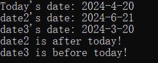

# 年月日的计算

## 程序介绍

此程序计算了当前的年月日，并且使用运算符重载，重载了`+`, `-`, `<`对Date类的计算。

### `Date` 类说明

#### 成员变量

- `year`: 表示日期的年份。
- `month`: 表示日期的月份。
- `day`: 表示日期的天数。

#### 私有成员函数

- `updateDaysMonth()`: 用于调整日期，确保 `day` 的值在 `month` 所对应月份的天数范围内。如果超出范围，会相应地调整 `month` 和 `year`。

#### 公有成员函数

- 构造函数 `Date(int y, int m, int d)`: 使用给定的年、月、日初始化一个 `Date` 对象，并调用 `updateDaysMonth()` 来确保日期的有效性。
- 运算符重载 `Date operator+(int days)`: 实现日期加上天数的操作，返回一个新的 `Date` 对象。
- 运算符重载 `Date operator-(int days)`: 实现日期减去天数的操作，返回一个新的 `Date` 对象。
- 运算符重载 `bool operator<(const Date& other) const`: 比较两个日期，如果当前对象的日期在另一个日期之前，返回 `true`。
- `void print() const`: 打印 `Date` 对象的年、月、日。

### `main` 函数说明

1. 使用 `time` 函数获取当前时间的 `time_t` 表示。
2. 使用 `localtime_s` 函数将 `time_t` 转换为 `tm` 结构体，获取本地时间。
3. 从 `tm` 结构体中提取当前的年、月、日。
4. 使用提取的时间创建一个 `Date` 对象 `today`。
5. 打印今天日期。
6. 通过 `today + 62` 获取62天后的日期，并将其存储在 `date2` 中，然后打印 `date2` 的日期。
7. 通过 `today - 31` 获取31天前的日期，并将其存储在 `date3` 中，然后打印 `date3` 的日期。
8. 使用 `<` 运算符比较 `date2` 和 `today`，打印它们之间的时间关系。
9. 使用 `<` 运算符比较 `date3` 和 `today`，打印它们之间的时间关系。

## 完整代码

```c++
#include <iostream>
#include <ctime>
using namespace std;

class Date {
private:
    int year, month, day;

    // 计算并设置当前日期的天数
    void updateDaysMonth() {
        static const int daysInMonth[12] = { 31, 31, 28, 31, 30, 31, 30, 31, 31, 30, 31, 30 };
        while (month <= 0) {
            year--;
            month += 12;
        }
        while (day > daysInMonth[month%12]) {
            day -= daysInMonth[month%12];
            month++;
        }
        while (day <= 0) {
            month--;
            if (month == 0) {
                month = 12;
                year--;
            }
            day += daysInMonth[month % 12];
        }
        while (month > 12) {
            month -= 12;
            year++;
        }
    }

public:
    // 构造函数
    Date(int y, int m, int d) : year(y), month(m), day(d) {
        updateDaysMonth();
    }

    // 运算符重载：加法
    Date operator+(int days) {
        Date newDate = *this;
        newDate.day += days;
        newDate.updateDaysMonth();
        return newDate;
    }

    // 运算符重载：减法
    Date operator-(int days) {
        Date newDate = *this;
        newDate.day -= days;
        newDate.updateDaysMonth();
        return newDate;
    }

    // 运算符重载：小于，用于日期比较
    bool operator<(const Date& other) const {
        if (year != other.year) return year < other.year;
        if (month != other.month) return month < other.month;
        return day < other.day;
    }

    // 打印日期
    void print() const {
        cout << year << "-" << month << "-" << day << endl;
    }
};

int main() {
    // 获取当前时间
    time_t now = time(nullptr);
    struct tm now_tm;
    localtime_s(&now_tm, &now);

    int year = now_tm.tm_year + 1900;
    int month = now_tm.tm_mon + 1;
    int day = now_tm.tm_mday;

    Date today(year, month, day);
    cout << "Today's date: ";
    today.print();

    Date date2 = today + 62;
    cout << "date2's date: ";
    date2.print();

    Date date3 = today - 31;
    cout << "date3's date: ";
    date3.print();

    if (date2 < today) {
        cout << "date2 is before today!" << endl;
    }
    else {
        cout << "date2 is after today!" << endl;
    }

    if (date3 < today) {
        cout << "date3 is before today!" << endl;
    }
    else {
        cout << "date3 is after today!" << endl;
    }

    return 0;
}
```

## 运行结果


