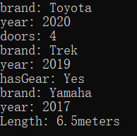

# 交通工具

## 程序说明

本程序是一个关于交通工具类的继承和派生示例。它定义了一个基类 `Vehicle` 和三个派生类 `Car`、`Bicycle` 和 `Boat`，用以展示如何在C++中使用面向对象编程技术。

## 类设计

### 基类 `Vehicle`

- **属性**:
  - `brand`: 字符串类型，表示交通工具的品牌。
  - `year`: 整型，表示交通工具的生产年份。
- **构造函数**:
  - `Vehicle(const string& brand, int year)`: 使用品牌和年份信息初始化 `Vehicle` 对象。
- **成员函数**:
  - `virtual void display()`: 虚函数，用于打印交通工具的品牌和年份。
  - `virtual ~Vehicle()`: 虚析构函数，确保派生类的析构函数被调用。

### 派生类 `Car`

- **属性**:
  - `doors`: 整型，表示汽车的门数。
- **构造函数**:
  - `Car(const string& brand, int year, int doors)`: 使用品牌、年份和门数信息初始化 `Car` 对象。
- **重写函数**:
  - `void display() override`: 重写基类的 `display` 函数，打印汽车的额外信息（门数）。

### 派生类 `Bicycle`

- **属性**:
  - `hasGear`: 布尔型，表示自行车是否有变速齿轮。
- **构造函数**:
  - `Bicycle(const string& brand, int year, bool hasGear)`: 使用品牌、年份和是否有齿轮信息初始化 `Bicycle` 对象。
- **重写函数**:
  - `void display() override`: 重写基类的 `display` 函数，打印自行车的额外信息（是否有齿轮）。

### 派生类 `Boat`

- **属性**:
  - `length`: 浮点型，表示船的长度（以米为单位）。
- **构造函数**:
  - `Boat(const string& brand, int year, float length)`: 使用品牌、年份和长度信息初始化 `Boat` 对象。
- **重写函数**:
  - `void display() override`: 重写基类的 `display` 函数，打印船的额外信息（长度）。


## 完整代码

```c++
#include<iostream>
#include<string>
using namespace std;

class Vehicle {
private:
	string brand;
	int year;

public:
	Vehicle(const string& brand, int year):brand(brand), year(year){}
	virtual void display() { cout << "brand: " << brand << endl << "year: " << year << endl; }
	virtual ~Vehicle(){}
};

class Car: public Vehicle{
private:
	int doors;

public:
	Car(const string& brand, int year, int doors):Vehicle(brand, year), doors(doors) {}
	void display() override { 
		Vehicle::display();
		cout << "doors: " << doors << endl;
	}
};

class Bicycle : public Vehicle {
private:
	bool hasGear;

public:
	Bicycle(const string& brand, int year, bool hasGear) :Vehicle(brand, year), hasGear(hasGear) {}
	void display() override {
		Vehicle::display();
		cout << "hasGear: " << (hasGear ? "Yes" : "No") << endl;
	}
};

class Boat : public Vehicle{
private:
	float length;

public:
	Boat(const string& brand, int year, float length):Vehicle(brand, year), length(length) {}
	void display() override {
		Vehicle::display();
		cout << "Length: " << length << "meters" << endl;
	}
};

int main() {
	Car car("Toyota", 2020, 4);
	Bicycle bicycle("Trek", 2019, true);
	Boat boat("Yamaha", 2017, 6.5);

	car.display();
	bicycle.display();
	boat.display();

	return 0;
}
```

## 运行结果


