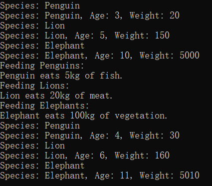

# Zoo

## 程序概述

本程序模拟了一个简单的动物园管理系统，展示了如何在C++中使用面向对象编程技术，包括类的定义、继承、多态以及动态内存分配。

## 类设计说明

### 基类 `Animal`

- **属性**:
  - `species`: 字符串类型，表示动物的种类。
  - `age`: 整数类型，表示动物的年龄。
  - `weight`: 浮点数类型，表示动物的体重。
- **构造函数**:
  - `Animal(string s, int a, float w)`: 使用种类、年龄和体重信息初始化 `Animal` 对象。
- **虚函数**:
  - `virtual void eat() = 0`: 纯虚函数，定义了动物吃东西的行为，由派生类实现。
  - `virtual ~Animal()`: 虚析构函数，确保派生类的析构函数被正确调用。
- **成员函数**:
  - `void grow()`: 使动物年龄增加一岁，体重增加10kg。
  - `void displayInfo() const`: 打印动物的信息。
  - `string getName()`: 返回动物的种类。

### 派生类 `Lion`、`Elephant` 和 `Penguin`

- **继承**: 所有派生类均继承自 `Animal` 基类。
- **构造函数**: 各派生类使用其特定的构造函数初始化，并传递参数给基类的构造函数。
- **重写函数**:
  - `void eat() override`: 每个派生类重写了 `eat` 函数，以实现其特定的吃东西行为。

### 类 `Zoo`

- **属性**:
  - `animals`: 一个 `unordered_map`，存储了不同种类的动物集合。
- **成员函数**:
  - `void addAnimal(Animal* animal)`: 将一个动物对象添加到动物园。
  - `void displayAllAnimals()`: 显示所有动物的信息。
  - `void feedAnimals()`: 喂食所有动物，并打印每种动物的吃东西行为。
  - `void ageOneYear()`: 使所有动物年龄增长一岁，体重相应增加。
  - `Animal* findAnimal(const string& species, const string& name)`: 查找一个特定种类和名称的动物。

## 主函数 `main`

- **对象创建**: 创建了 `Lion`、`Elephant` 和 `Penguin` 的实例。
- **动物园管理**:
  - 创建 `Zoo` 实例。
  - 使用 `addAnimal` 函数将动物添加到动物园。
  - 调用 `displayAllAnimals` 显示所有动物的信息。
  - 调用 `feedAnimals` 喂食所有动物，并打印输出。
  - 调用 `ageOneYear` 使所有动物增长一岁。
  - 再次调用 `displayAllAnimals` 显示增长一岁后的所有动物信息。

## 完整代码

```c++
#include <iostream>
#include <vector>
#include <string>
#include <unordered_map>

using namespace std;

// 基类 Animal
class Animal {
public:
    string species;
    int age;
    float weight;

public:
    Animal(string s, int a, float w) : species(s), age(a), weight(w) {}

    virtual ~Animal() {}

    virtual void eat() = 0; // 纯虚函数，派生类需要实现
    void grow() {
        age++;
        weight += 10; // 假设每年增加10kg体重
    }

    void displayInfo() const {
        cout << "Species: " << species << ", Age: " << age << ", Weight: " << weight << endl;
    }

    string getName() { return species; }
};

// 派生类 Lion
class Lion : public Animal {
public:
    Lion(int a, float w) : Animal("Lion", a, w) {}

    void eat() override {
        cout << "Lion eats 20kg of meat." << endl;
        // 假设狮子每次吃20kg食物
    }
};

// 派生类 Elephant
class Elephant : public Animal {
public:
    Elephant(int a, float w) : Animal("Elephant", a, w) {}

    void eat() override {
        cout << "Elephant eats 100kg of vegetation." << endl;
        // 假设大象每次吃100kg食物
    }
};

// 派生类 Penguin
class Penguin : public Animal {
public:
    Penguin(int a, float w) : Animal("Penguin", a, w) {}

    void eat() override {
        cout << "Penguin eats 5kg of fish." << endl;
        // 假设企鹅每次吃5kg食物
    }
};

// 类 Zoo
class Zoo {
private:
    unordered_map<string, vector<Animal*>> animals;

public:
    void addAnimal(Animal* animal) {
        animals[animal->species].push_back(animal);
    }

    void displayAllAnimals() {
        for (const auto& pair : animals) {
            cout << "Species: " << pair.first << endl;
            for (Animal* animal : pair.second) {
                animal->displayInfo();
            }
        }
    }

    void feedAnimals() {
        for (const auto& pair : animals) {
            cout << "Feeding " << pair.first << "s:" << endl;
            for (Animal* animal : pair.second) {
                animal->eat();
            }
        }
    }

    void ageOneYear() {
        for (auto& pair : animals) {
            for (Animal* animal : pair.second) {
                animal->grow();
            }
        }
    }

    Animal* findAnimal(const string& species, const string& name) {
        for (const auto& pair : animals) {
            for (Animal* animal : pair.second) {
                if (animal->species == species && animal->getName() == name) {
                    return animal;
                }
            }
        }
        return nullptr;
    }
};

int main() {
    // 创建动物实例
    Lion lion(5, 150);
    Elephant elephant(10, 5000);
    Penguin penguin(3, 20);

    // 创建动物园实例
    Zoo zoo;

    // 添加动物到动物园
    zoo.addAnimal(&lion);
    zoo.addAnimal(&elephant);
    zoo.addAnimal(&penguin);

    // 显示所有动物
    zoo.displayAllAnimals();

    // 喂食所有动物
    zoo.feedAnimals();

    // 动物成长一年
    zoo.ageOneYear();

    // 再次显示所有动物
    zoo.displayAllAnimals();

    return 0;
}
```

## 运行结果

