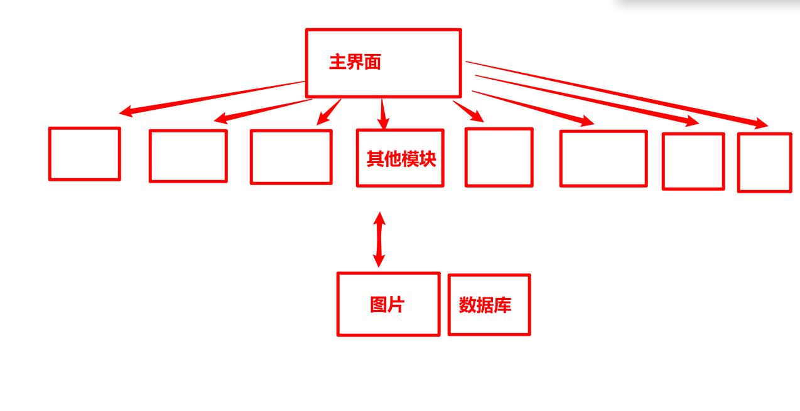
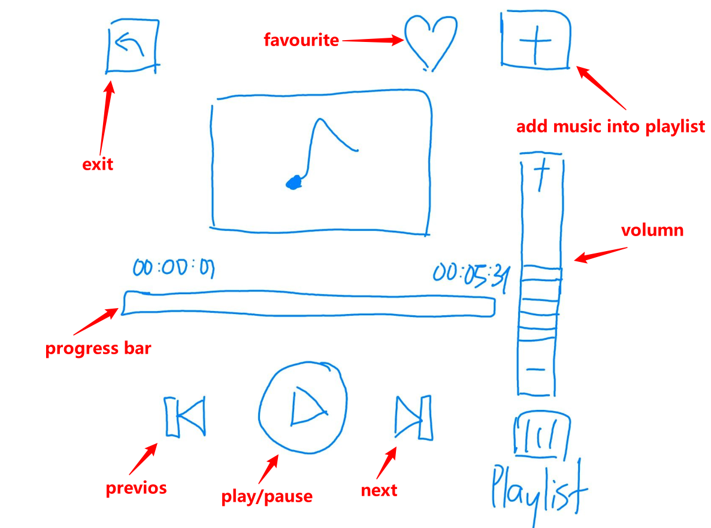
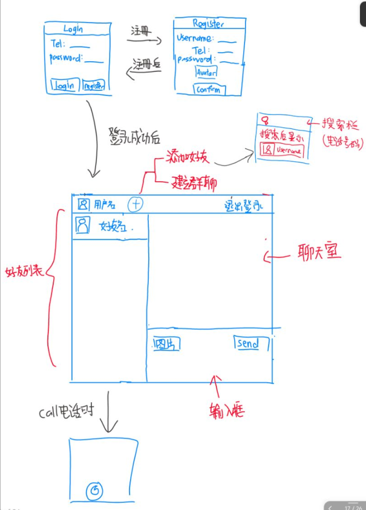
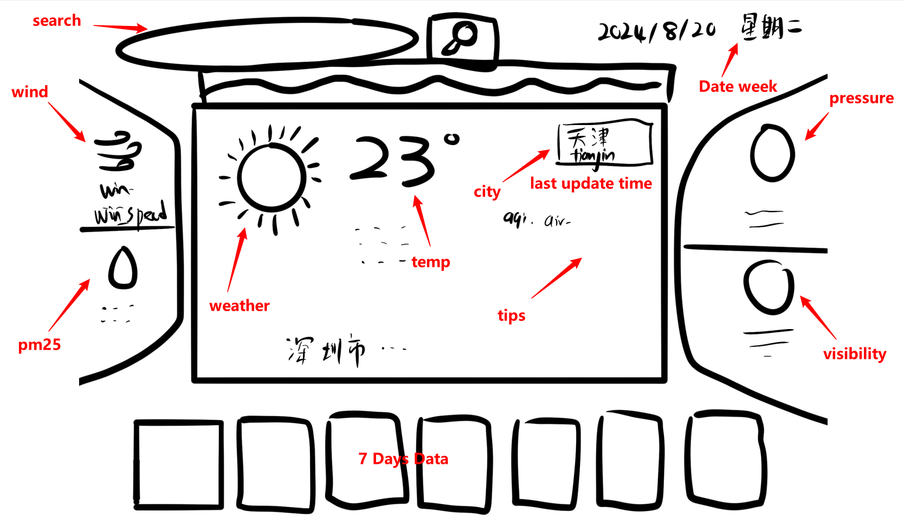
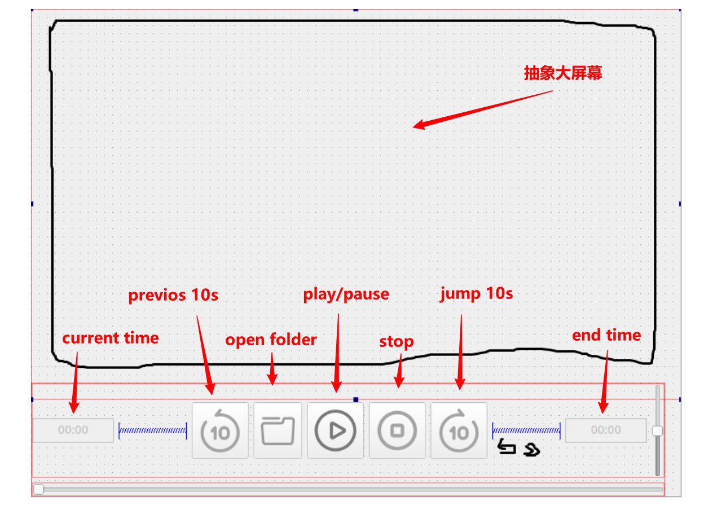
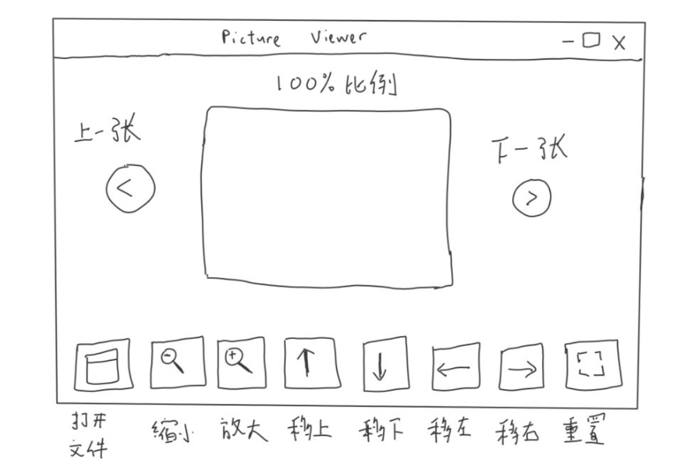
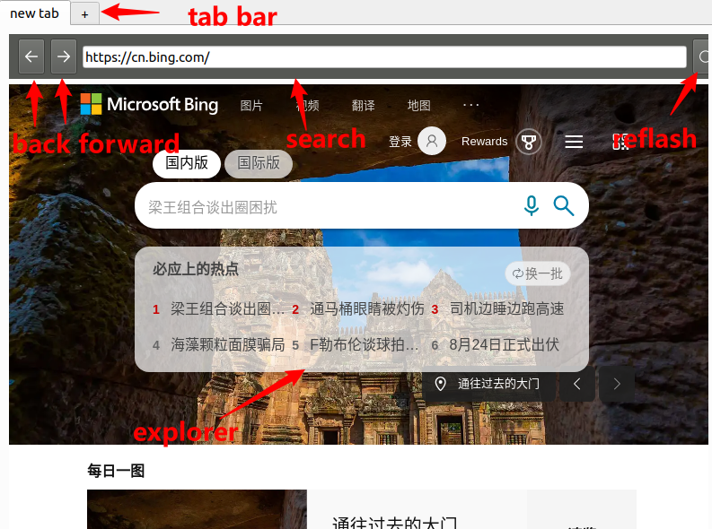
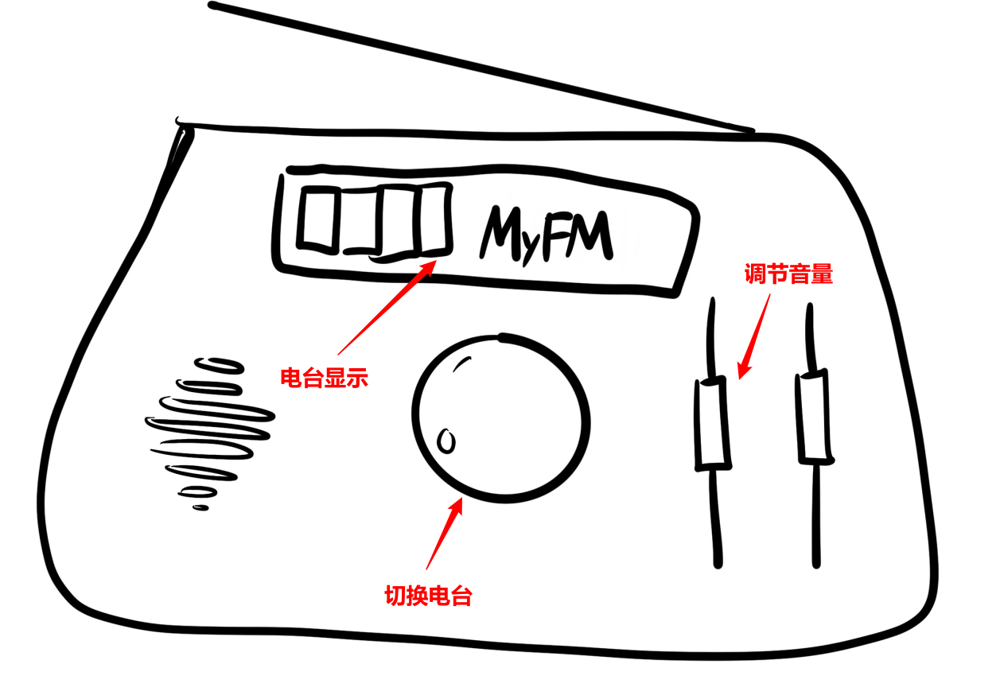
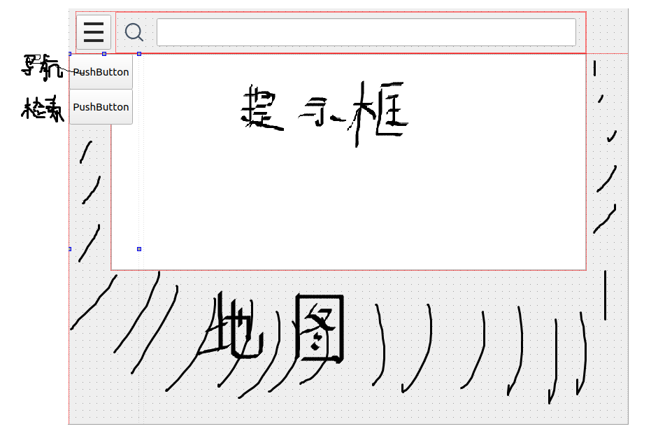
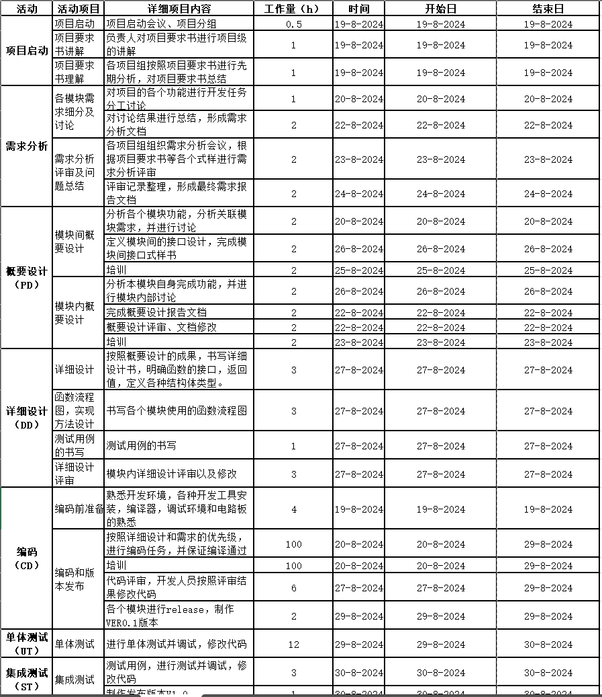

# 0824开题答辩

## 1. 项目需求

项目选择: ==汽车车载系统==

项目模块:

1. **主界面模块**
2. **音乐播放模块**
3. **即时通讯模块**
4. **天气预报模块**
5. **视频播放模块**
6. **图片预览模块**
7. **浏览器模块**
8. **收音机模块**
9. **定位模块**



---

## 2. 模块分析

### 音乐播放模块



> 功能
>
> ```
> 播放/暂停
> 下一首/上一首
> 本地文件获取
> 随机播放/顺序播放/单曲循坏
> 音量调节
> ```
>
> 
>
> 功能实现方案
>
> ```
> QMediaPlayer -- 实现音乐控件, 音量的调节等
> QFile -- 读取本地文件
> QMediaPlayList -- playList
> ```


### 即使通讯模块



> 功能
>
> ```
> 登录/注册
> 好友添加
> 好友聊天
> 群聊
> 图片上传
> 语音聊天
> ```
>
> 
>
> 功能实现方案
>
> ```
> 数据库:
> QSqlDatabase
> QSqlQuery
> QSqlError
> 
> 好友聊天:
> QTcpSocket
> QTcpServer
> 
> 群聊:
> QUtpSocket
> 
> 其他:
> QFile ...
> ```


### 天气预报模块



> 功能
>
> ```
> 显示当前时间段的最新天气数据(风向,可见度等等)
> 显示当天其他时间段的气候
> 显示一个星期的天气情况
> 搜索某个城市当天以及一个星期的天气情况
> ```
>
> 
>
> 功能实现方案
>
> ```
> 网络请求:
> QNetworkAccessManager
> QUrl
> QNetworkRequest
> QNetworkReply
> 
> 数据处理:
> QJsonObject
> QJsonDocument
> QJsonArray
> ...
> ```


### 视频播放



> 功能
>
> ```
> 播放/暂停
> 前后跳10秒
> 本地文件获取
> 单片循坏
> 音量调节
> 倍数观看
> 关闭视频
> ```
>
> 
>
> 功能实现方案
>
> ```
> QMediaPlayer -- 实现音乐控件, 音量的调节等
> QVideoWidget -- 视频显示
> QFile -- 读取本地文件
> ```


### 图片预览模块



> 功能
>
> ```
> 图片放大缩小
> 图片位移
> 图片90°旋转
> 图片重置
> 显示下一张/上一张图片
> ```
>
> 
>
> 功能实现
>
> ```
> QImage
> QPixMap
> QFile
> ...
> ```


### 浏览器模块



> 功能
>
> ```
> 前进/后退
> 刷新
> 网址搜索
> 新标签页打开关闭
> ```
>
> 
>
> 功能实现方案
>
> ```
> 浏览器:
> QWebEngineView
> QAbstractSocket
> ```


### 收音机模块



> 功能
>
> ```
> 当前电台播放
> 电台频道切换
> ```
>
> 
>
> 功能实现方案
>
> ```
> QWebEngineView
> QNetworkAccessManager
> QUrl
> QNetworkRequest
> QNetworkReply
> ```


### 定位模块



> 功能
>
> ```
> 导航检索
> 搜索目的地
> 地图浏览
> 搜索提示框
> ```
>
> 功能实现方案
>
> ```
> 网络请求:
> QWebEngineView
> QWebEngineView
> QNetworkAccessManager
> QUrl
> QNetworkRequest
> QNetworkReply
> 
> 数据处理:
> QJsonObject
> QJsonDocument
> QJsonArray
> ```


---

## 3. 成员职责

| 姓名   | 工作职责 | 模块                             |
| ------ | -------- | -------------------------------- |
| 丘绎楦 | TL+ SCML | 天气预报，浏览器，收音机，主页面 |
| 曾泇睷 | PRL + PE | 视频，定位，资源管理器，主页面   |
| 孙将斌 | PE       | 即时通讯                         |
| 陈家豪 | PE       | 音乐                             |
| 黄奕瀚 | PE       | 图片预览                         |

---

## 4. 计划



