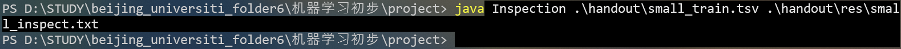
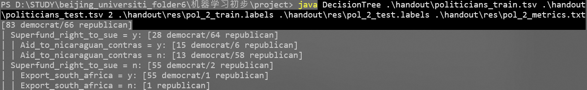
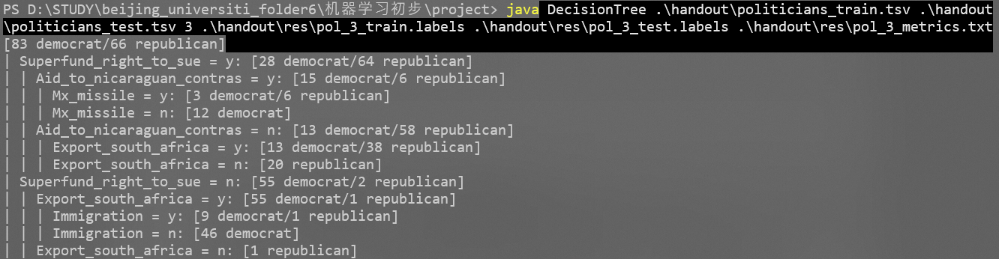
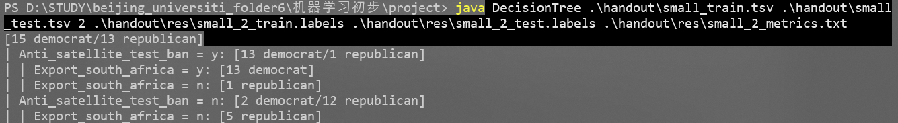
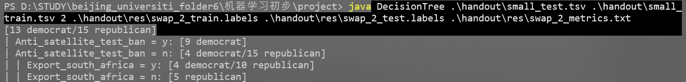
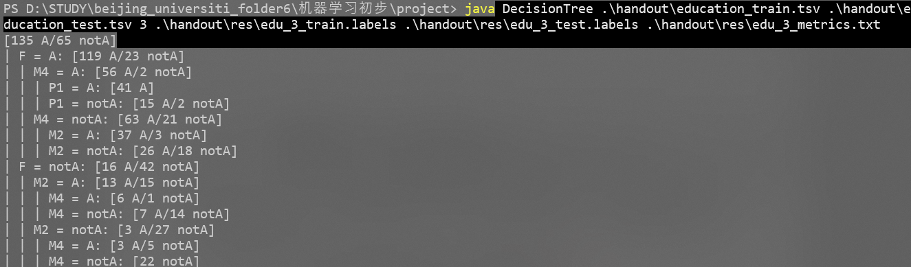
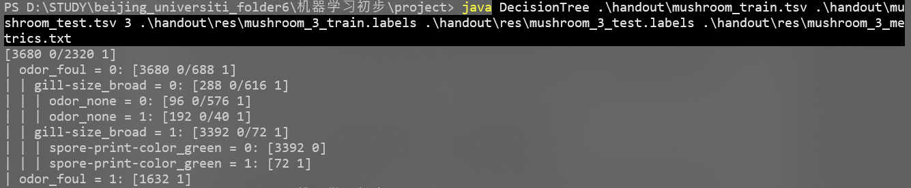
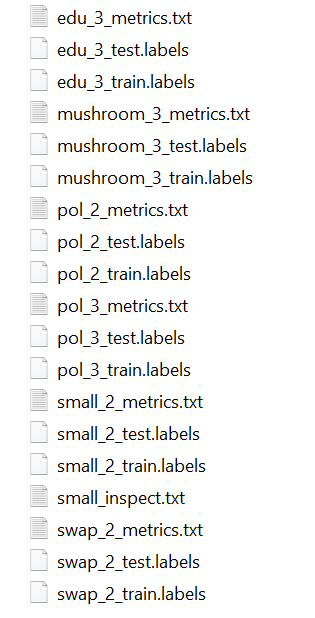

|  姓名  |    学号    |
| :----: | :--------: |
| 丘绎楦 | 1820221050 |

# Machine Learning Homework

## 📁文件目录


   ```
   │   报告.md  # 项目报告文档
   │
   ├───img  # 报告.md的图片资源
   │      
   │
   └───源程序  
   	│   DecisionTree.class      # 决策树程序的编译后字节码文件
   	│   DecisionTree.java       # 决策树算法的Java源代码
   	│   Inspection.class        # 检查工具的编译后字节码文件  
   	│   Inspection.java         # 检查工具的Java源代码
   	│   TreeNode.class          # 树节点结构的编译后字节码文件
   	│   TreeNode.java           # 树节点结构的Java源代码
       │
       │
       └───handout  # 数据集和资源文件夹
           │   .DS_Store
           │   education_test.tsv
           │   education_train.tsv
           │   mushroom_test.tsv
           │   mushroom_train.tsv
           │   politicians_test.tsv
           │   politicians_train.tsv
           │   small_test.tsv
           │   small_train.tsv
           │
           ├───example_output  # 示例输出目录
           │       small_3_metrics.txt
           │       small_3_test.labels
           │       small_3_train.labels
           │
           └───res  # 实际运行结果目录
                   edu_3_metrics.txt
                   edu_3_test.labels
                   edu_3_train.labels
                   mushroom_3_metrics.txt
                   mushroom_3_test.labels
                   mushroom_3_train.labels
                   pol_2_metrics.txt
                   pol_2_test.labels
                   pol_2_train.labels
                   pol_3_metrics.txt
                   pol_3_test.labels
                   pol_3_train.labels
                   small_2_metrics.txt
                   small_2_test.labels
                   small_2_train.labels
                   small_inspect.txt
                   swap_2_metrics.txt
                   swap_2_test.labels
                   swap_2_train.labels
   ```


## 💻程序#1: Inspecting the Data

### 概述

本程序（`Inspection.java`）用于分析输入文件中的标签分布，计算信息熵和分类错误率，并将结果写入指定输出文件。适用于分类任务的基准分析，例如评估数据集的纯度或分类模型的基线性能。

### 源代码

```java
import java.io.*;
import java.util.Collections;
import java.util.HashMap;
import java.util.Map;

public class Inspection {
    public static void main(String[] args) {
        if (args.length != 2) {
            System.err.println("Usage: java Inspection <input> <output>");
            System.exit(1);
        }

        try {
            inspect(args[0], args[1]);
        } catch (IOException e) {
            System.err.println("Error: " + e.getMessage());
            System.exit(1);
        }
    }

    private static void inspect(String inputPath, String outputPath) throws IOException {
        Map<String, Integer> labelCounts = new HashMap<>();
        int total = 0;

        try (BufferedReader reader = new BufferedReader(new FileReader(inputPath))) {
            reader.readLine();

            String line;
            while ((line = reader.readLine()) != null) {
                String[] columns = line.split("\t");
                if (columns.length == 0) continue;
                String label = columns[columns.length - 1];
                labelCounts.put(label, labelCounts.getOrDefault(label, 0) + 1);
                total++;
            }
        }

        if (total == 0) {
            writeResults(outputPath, 0.0, 0.0);
            return;
        }

        // 计算熵
        double entropy = 0.0;
        for (int count : labelCounts.values()) {
            double p = (double) count / total;
            if (p > 0) {
                entropy -= p * (Math.log(p) / Math.log(2));
            }
        }

        // 计算错误率
        int maxCount = Collections.max(labelCounts.values());
        double errorRate = 1.0 - ((double) maxCount / total);

        writeResults(outputPath, entropy, errorRate);
    }

    private static void writeResults(String path, double entropy, double error) throws IOException {
        try (PrintWriter writer = new PrintWriter(new FileWriter(path))) {
            writer.printf("entropy: %.12f%n", entropy);
            writer.printf("error: %.12f%n", error);
        }
    }
}
```

### 模块划分

1. **输入处理模块**

   - 功能：读取输入文件，解析标签并统计频次。
   - 输入文件格式要求：每行以制表符（`\t`）分隔，最后一列为标签。首行视为标题行，自动跳过。
   - 异常处理：空行或无效行会被跳过。

2. **计算模块**

   - **熵（Entropy）**：衡量标签分布的不确定性，公式为：

     $H=-\sum_{}^{} p_i log_2p_i$

     其中 $p_i$ 为标签 $i$ 的频率。

   - **错误率（Error Rate）**：假设以最多出现的标签作为预测结果，错误率计算公式为：

     $Error Rate = 1 - \frac{最大标签频次}{总样本数}$

3. **输出模块**

   - 将熵和错误率按 `entropy: <值>` 和 `error: <值>` 格式写入输出文件，保留12位小数。

### 算法选择

- **熵计算**：采用信息论标准公式，确保量化标签分布的混乱程度。
- **错误率计算**：基于多数类别的正确率，提供分类任务的基准性能参考。

### 异常处理

- 命令行参数校验：输入参数不足时提示正确用法并退出。
- 文件读写异常：捕获 `IOException` 并输出友好错误信息。
- 空数据处理：若输入文件无有效数据，直接输出零值。

### 实验过程与结果

1. 编译java文件(Inspection.java)

   ```
   javac .\Inspection.java
   ```

   > 执行后会生成字节码文件(Inspection.class)

2. 执行

   ```
   java Inspection .\handout\small_train.tsv .\handout\res\small_inspect.txt
   ```

   
   
   > 执行后会在`.\handout\res`路径下创建一个文件`small_inspect.txt`
   
   结果为:
   
   ```
   entropy: 0.996316519559
   error: 0.464285714286
   ```

## 💻程序#2: Decision Tree Learner

### 概述

本程序（`DecisionTree.java`）实现了一个基于信息增益的决策树分类器，支持训练和测试数据的处理，并输出预测结果和性能指标。适用于监督学习任务，能够处理表格数据（TSV格式），自动选择最优特征进行节点分裂，生成可解释的树结构。

### 源代码

```java
import java.io.*;
import java.util.*;
import java.util.stream.Collectors;

public class DecisionTree {
    public static void main(String[] args) {
        if (args.length != 6) {
            System.err.println("Usage: java decisionTree <train_input> <test_input> <max_depth> <train_out> <test_out> <metrics_out>");
            System.exit(1);
        }

        String trainInputPath = args[0];
        String testInputPath = args[1];
        int maxDepth = Integer.parseInt(args[2]);
        String trainOutputPath = args[3];
        String testOutputPath = args[4];
        String metricsOutputPath = args[5];

        try {
            List<List<String>> trainData = readTSV(trainInputPath);
            List<List<String>> testData = readTSV(testInputPath);

            List<String> headers = new ArrayList<>(trainData.get(0));
            trainData.remove(0);
            testData.remove(0);

            TreeNode root = buildTree(trainData, headers, maxDepth, 0);
            printTree(root, headers, 0, "", "");

            List<String> trainLabels = getLabels(trainData);
            List<String> testLabels = getLabels(testData);

            List<String> trainPredictions = predict(trainData, headers, root);
            List<String> testPredictions = predict(testData, headers, root);

            writeLabels(trainOutputPath, trainPredictions);
            writeLabels(testOutputPath, testPredictions);

            double trainError = calculateError(trainLabels, trainPredictions);
            double testError = calculateError(testLabels, testPredictions);
            writeMetrics(metricsOutputPath, trainError, testError);

        } catch (IOException e) {
            System.err.println("Error: " + e.getMessage());
            System.exit(1);
        }
    }

    // ---------- 核心方法 ----------
    static TreeNode buildTree(List<List<String>> data, List<String> headers, int maxDepth, int currentDepth) {
        Map<String, Integer> classCounts = getClassCounts(data);
        if (classCounts.size() == 1 || currentDepth >= maxDepth) {
            return new TreeNode(getMajorityClass(classCounts), classCounts);
        }

        int bestAttrIndex = selectBestAttribute(data, headers);
        if (bestAttrIndex == -1) {
            return new TreeNode(getMajorityClass(classCounts), classCounts);
        }

        String bestAttr = headers.get(bestAttrIndex);
        TreeNode node = new TreeNode(bestAttr);
        node.classCounts = classCounts;

        Map<String, List<List<String>>> splits = new HashMap<>();
        for (List<String> row : data) {
            String attrValue = row.get(bestAttrIndex);
            splits.computeIfAbsent(attrValue, k -> new ArrayList<>()).add(row);
        }

        for (Map.Entry<String, List<List<String>>> entry : splits.entrySet()) {
            String attrValue = entry.getKey();
            List<List<String>> subset = entry.getValue();
            node.children.put(attrValue, buildTree(subset, headers, maxDepth, currentDepth + 1));
        }

        return node;
    }

    static int selectBestAttribute(List<List<String>> data, List<String> headers) {
        double maxMI = 0;
        int bestAttrIndex = -1;
        double classEntropy = calculateClassEntropy(data);

        for (int i = 0; i < headers.size() - 1; i++) {
            double attrMI = calculateMutualInformation(data, i, classEntropy);
            if (attrMI > maxMI) {
                maxMI = attrMI;
                bestAttrIndex = i;
            }
        }

        return maxMI > 0 ? bestAttrIndex : -1;
    }

    // ---------- 工具函数 ----------
    static double calculateMutualInformation(List<List<String>> data, int attrIndex, double classEntropy) {
        Map<String, List<List<String>>> splits = new HashMap<>();
        for (List<String> row : data) {
            String attrValue = row.get(attrIndex);
            splits.computeIfAbsent(attrValue, k -> new ArrayList<>()).add(row);
        }

        double conditionalEntropy = 0;
        for (List<List<String>> subset : splits.values()) {
            double p = (double) subset.size() / data.size();
            conditionalEntropy += p * calculateClassEntropy(subset);
        }

        return classEntropy - conditionalEntropy;
    }

    static double calculateClassEntropy(List<List<String>> data) {
        Map<String, Integer> classCounts = getClassCounts(data);
        double entropy = 0;
        for (int count : classCounts.values()) {
            double p = (double) count / data.size();
            entropy -= p * Math.log(p) / Math.log(2);
        }
        return entropy;
    }

    static Map<String, Integer> getClassCounts(List<List<String>> data) {
        Map<String, Integer> counts = new HashMap<>();
        int classIndex = data.get(0).size() - 1;
        for (List<String> row : data) {
            String className = row.get(classIndex);
            counts.put(className, counts.getOrDefault(className, 0) + 1);
        }
        return counts;
    }

    static String getMajorityClass(Map<String, Integer> classCounts) {
        return classCounts.entrySet().stream()
                .sorted((e1, e2) -> e2.getValue() != e1.getValue() ?
                        e2.getValue() - e1.getValue() :
                        e2.getKey().compareTo(e1.getKey()))
                .findFirst()
                .get()
                .getKey();
    }

    // ---------- 预测与输出 ----------
    static List<String> predict(List<List<String>> data, List<String> headers, TreeNode root) {
        return data.stream()
                .map(row -> predictRow(row, headers, root))
                .collect(Collectors.toList());
    }

    static String predictRow(List<String> row, List<String> headers, TreeNode node) {
        if (node.isLeaf()) {
            return node.label;
        }

        int attrIndex = headers.indexOf(node.attribute);
        String attrValue = row.get(attrIndex);
        TreeNode child = node.children.get(attrValue);

        return (child != null) ? predictRow(row, headers, child) : getMajorityClass(node.classCounts);
    }

    static void printTree(TreeNode node, List<String> headers, int depth, String parentAttr, String parentValue) {
        StringBuilder sb = new StringBuilder();
        for (int i = 0; i < depth; i++) sb.append("| ");
        if (depth > 0) sb.append(parentAttr).append(" = ").append(parentValue).append(": ");
        sb.append("[").append(
                node.classCounts.entrySet().stream()
                        .map(e -> e.getValue() + " " + e.getKey())
                        .collect(Collectors.joining("/"))
        ).append("]");
        System.out.println(sb);

        if (!node.isLeaf()) {
            node.children.forEach((value, child) ->
                    printTree(child, headers, depth + 1, node.attribute, value));
        }
    }

    static List<List<String>> readTSV(String filePath) throws IOException {
        List<List<String>> data = new ArrayList<>();
        try (BufferedReader br = new BufferedReader(new FileReader(filePath))) {
            String line;
            while ((line = br.readLine()) != null) {
                data.add(Arrays.asList(line.split("\t")));
            }
        }
        return data;
    }

    static List<String> getLabels(List<List<String>> data) {
        int classIndex = data.get(0).size() - 1;
        return data.stream().map(row -> row.get(classIndex)).collect(Collectors.toList());
    }

    static void writeLabels(String filePath, List<String> labels) throws IOException {
        try (BufferedWriter bw = new BufferedWriter(new FileWriter(filePath))) {
            for (String label : labels) bw.write(label + "\n");
        }
    }

    static double calculateError(List<String> trueLabels, List<String> predictedLabels) {
        int errors = 0;
        for (int i = 0; i < trueLabels.size(); i++) {
            if (!trueLabels.get(i).equals(predictedLabels.get(i))) errors++;
        }
        return (double) errors / trueLabels.size();
    }

    static void writeMetrics(String filePath, double trainError, double testError) throws IOException {
        try (BufferedWriter bw = new BufferedWriter(new FileWriter(filePath))) {
            bw.write(String.format("error(train): %.6f\n", trainError));
            bw.write(String.format("error(test): %.6f\n", testError));
        }
    }
}
```


### 模块划分

1. **数据读取模块**
   - 功能：从TSV文件读取训练和测试数据，解析为二维列表（`List<List<String>>`）。
   - 文件格式要求：首行为标题行，后续每行以制表符分隔，最后一列为标签。
   - 异常处理：自动跳过空行，依赖文件系统抛出 `IOException`。
2. **决策树构建模块**
   - **核心方法**：`buildTree`
     - 递归构建树结构，终止条件为：
       - 当前节点数据类别纯净（`classCounts.size() == 1`）。
       - 达到最大深度（`currentDepth >= maxDepth`）。
     - 特征选择：基于互信息（信息增益）选择最佳分裂属性（`selectBestAttribute`）。
   - **节点表示**：`TreeNode` 类存储属性名、子节点映射（`children`）和类别分布（`classCounts`）。
3. **预测模块**
   - **流程**：
     1. 对每条数据，从根节点递归匹配属性值，直到叶节点返回预测标签。
     2. 缺失分支处理：返回父节点多数类（`getMajorityClass`）。
   - 输出：分别生成训练集和测试集的预测标签文件。
4. **评估与输出模块**
   - **性能计算**：`calculateError` 统计预测错误率。
   - **结果输出**：
     - 树结构打印：格式化显示节点分裂条件和类别分布（`printTree`）。
     - 指标文件：记录训练集和测试集的错误率（`writeMetrics`）。

### 算法选择

- **特征选择**：使用互信息（信息增益）最大化准则，公式为：

  $MI(X,Y)=H(Y)−H(Y∣X)$

  其中 $H(Y)$ 为标签熵，$H(Y∣X)$ 为给定特征的条件熵。

- **终止条件**：结合预剪枝（最大深度）和后剪枝（类别纯净）策略，防止过拟合。

### 异常处理

- 命令行参数校验：参数不足时提示用法并退出。
- 文件读写异常：捕获 `IOException` 并输出错误信息。
- 默认处理：缺失分支预测使用父节点多数类，避免预测失败。

### 实验过程与结果

1. 编译java文件(DecisionTree.java & TreeNode.java)

   ```
   javac -encoding UTF-8 .\TreeNode.java .\DecisionTree.java
   ```

   > 执行后会出现两个字节码文件(`DecisionTree.class`&`TreeNode.class`)

2. 执行

   1. ```
      java DecisionTree .\handout\politicians_train.tsv .\handout\politicians_test.tsv 2 .\handout\res\pol_2_train.labels .\handout\res\pol_2_test.labels .\handout\res\pol_2_metrics.txt
      ```

      

   2. ```
      java DecisionTree .\handout\politicians_train.tsv .\handout\politicians_test.tsv 3 .\handout\res\pol_3_train.labels .\handout\res\pol_3_test.labels .\handout\res\pol_3_metrics.txt
      ```

      

   3. ```
      java DecisionTree .\handout\small_train.tsv .\handout\small_test.tsv 2 .\handout\res\small_2_train.labels .\handout\res\small_2_test.labels .\handout\res\small_2_metrics.txt
      ```

      

   4. ```
      java DecisionTree .\handout\small_test.tsv .\handout\small_train.tsv 2 .\handout\res\swap_2_train.labels .\handout\res\swap_2_test.labels .\handout\res\swap_2_metrics.txt
      ```

      

   5. ```
      java DecisionTree .\handout\education_train.tsv .\handout\education_test.tsv 3 .\handout\res\edu_3_train.labels .\handout\res\edu_3_test.labels .\handout\res\edu_3_metrics.txt
      ```

      

   6. ```
      java DecisionTree .\handout\mushroom_train.tsv .\handout\mushroom_test.tsv 3 .\handout\res\mushroom_3_train.labels .\handout\res\mushroom_3_test.labels .\handout\res\mushroom_3_metrics.txt
      ```

      

      > 执行完后,会生成如下图所示的文件
      >
      > 

3. 结果(<kbd>Ctrl</kbd> + `click` 跳转文件)

   1. [pol_2_train.labels](./handout/res/pol_2_train.labels) & [pol_2_test.labels](./handout/res/pol_2_test.labels) & [pol_2_metrics.txt](./handout/res/pol_2_metrics.txt)
   
      结果分析:
   
      - **训练误差中等：** 训练集上的错误率为 **0.134228（约 13.42%）**，表明模型对训练数据有一定的拟合能力，但仍有改进空间。
      - **测试误差较高：** 测试集上的错误率为 **0.156627（约 15.66%）**，略高于训练误差，可能存在轻微的过拟合现象，或模型泛化能力不足。
   2. [pol_3_train.labels](./handout/res/pol_3_train.labels) & [pol_3_test.labels](./handout/res/pol_3_test.labels) & [pol_3_metrics.txt](./handout/res/pol_3_metrics.txt)
   
      结果分析:
   
      - **训练误差较低：** 训练集上的错误率为 **0.114094（约 11.41%）**，模型在训练数据上表现较好，拟合能力较强。
      - **测试误差显著升高：** 测试集上的错误率为 **0.168675（约 16.87%）**，明显高于训练误差，表明模型存在过拟合问题，泛化能力较差。
   3. [small_2_train.labels](./handout/res/small_2_train.labels) & [small_2_test.labels](./handout/res/small_2_test.labels) & [small_2_metrics.txt](./handout/res/small_2_metrics.txt)
   
      结果分析:
   
      - **训练误差较低：** 训练集上的错误率相对较低（约 7.14%），表明模型能够较好地拟合训练数据。
   
      - **测试误差较高：** 测试集上的错误率较高（约 14.29%），由于模型在训练数据上过拟合，导致其在未见过的数据上表现较差。
   4. [swap_2_train.labels](./handout/res/swap_2_train.labels) & [swap_2_test.labels](./handout/res/swap_2_test.labels) & [swap_2_metrics.txt](./handout/res/swap_2_metrics.txt)
   
      结果分析:
   
      - **训练误差中等偏高：** 训练集上的错误率为 **0.142857（约 14.29%）**，模型对训练数据的拟合效果一般，可能存在欠拟合或模型复杂度不足的问题。
      - **测试误差较低：** 测试集上的错误率为 **0.107143（约 10.71%）**，低于训练误差，表明模型在未见数据上表现更好，可能是训练数据噪声较多或模型具有一定的正则化效果。
   5. [edu_3_train.labels](./handout/res/edu_3_train.labels) & [edu_3_test.labels](./handout/res/edu_3_test.labels) & [edu_3_metrics.txt](./handout/res/edu_3_metrics.txt)
   
      结果分析:
   
      - **训练误差较高：** 训练集上的错误率相对较低（约 17%），模型在训练数据上并没有达到很好的拟合效果，可能存在欠拟合的情况。
   
      - **测试误差较高：** 测试集上的错误率较高（约 20.5%），表明模型可能没有足够的能力来泛化到新的数据集上。
   6. [mushroom_3_train.labels](./handout/res/mushroom_3_train.labels) & [mushroom_3_test.labels](./handout/res/mushroom_3_test.labels) & [mushroom_3_metrics.txt](./handout/res/mushroom_3_metrics.txt)
   
      结果分析:
   
      - **训练误差低：** 训练集上的错误率为 **0.022667（约 2.27%）**，模型在训练数据上拟合效果非常好，能够以极低的错误率学习数据中的特征。
   
      - **测试误差分低：** 测试集上的错误率为 **0.020716（约 2.07%）**，与训练误差非常接近，甚至略低。
   
      

## 💭实验感想

通过本次基于Java实现的决策树实验，我对机器学习算法的工程实现有了更深入的认识。在实验过程中，我从零开始构建了完整的决策树分类器，获得了以下重要收获：

首先，在数据结构设计方面，我学会了使用Map<String, TreeNode>来表示树的子节点关系，这种基于引用的树结构实现方式让我对Java面向对象特性有了新的理解。特别是在处理递归结构时，通过TreeNode类的设计，将算法逻辑清晰地封装在对象中，大大提高了代码的可读性。

在算法实现层面，我深入理解了信息增益的计算过程。通过手动实现calculateMutualInformation方法，我切实掌握了熵和条件熵的概念，以及它们在特征选择中的重要作用。调试过程中，我发现对数值计算需要特别注意边界条件，比如当概率为0时的处理，这让我对算法细节的把控更加严谨。

在工程实践方面，我积累了宝贵的经验。使用BufferedReader处理TSV文件时，我学会了如何高效解析表格数据；通过try-with-resources语句，我规范了资源管理的方式；在递归构建树的过程中，我掌握了通过深度参数控制递归终止条件的技巧。

实验过程中也遇到了一些挑战。比如在实现printTree方法时，如何优雅地格式化输出树形结构让我思考了很久，最终通过StringBuilder和递归配合解决了这个问题。这让我意识到算法实现不仅要考虑功能性，还需要注重输出的可读性。

通过对比不同max_depth参数下的模型表现，我直观地理解了模型复杂度与泛化能力的关系。当设置max_depth过大时，训练误差虽然降低，但测试误差上升，这让我对过拟合现象有了更具体的认识。

这次实验让我认识到，将理论知识转化为实际代码需要多方面的能力：既要深入理解算法原理，又要掌握工程实现技巧，还需要具备调试和优化的能力。这些经验对我后续学习更复杂的机器学习算法有着重要的指导意义。
